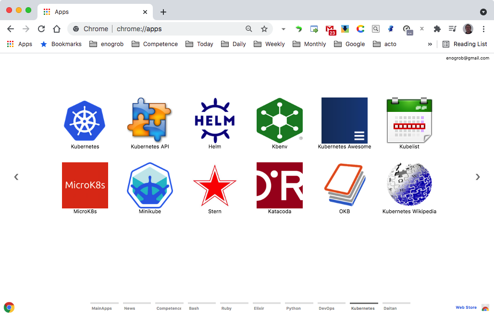

# Chrome Apps for Kubernetes


## Installation

### 1. Clone this repository and see its contents.
Open a terminal give the following command:

```bash
$ git clone https://github.com/enogrob/chromeapps-kubernetes.git
```

As we can see a subdirectory is created for each Bash app.

```bash
$ ls -la
total 984
drwxr-xr-x@  10 enogrob  staff    340 Jul  2 09:38 .
drwxr-xr-x@ 405 enogrob  staff  13770 Jul  2 09:33 ..
-rw-r--r--@   1 enogrob  staff   6148 Oct  4  2020 .DS_Store
drwxr-xr-x   13 enogrob  staff    442 Jul  2 11:15 .git
-rw-r--r--    1 enogrob  staff      5 May 31  2016 .gitignore
-rw-r--r--@   1 enogrob  staff      0 Nov 17  2016 Icon?
-rw-r--r--@   1 enogrob  staff   1555 Jul  2 09:37 README.md
drwxr-xr-x   14 enogrob  staff    476 Jul  2 11:26 apps
drwxr-xr-x    4 enogrob  staff    136 Jul  1 14:30 images
drwxr-xr-x    4 enogrob  staff    136 Jul  1 06:41 resources
total 984

$ tree -L 1 apps/
apps
├── Kubernetes-API
├── Kubernetes-Awesome
├── Kubernetes-Helm
├── Kubernetes-Homepage
├── Kubernetes-Katacoda
├── Kubernetes-Kbenv
├── Kubernetes-Kubelist
├── Kubernetes-MicroK8s
├── Kubernetes-Minikube
├── Kubernetes-OKB
├── Kubernetes-Stern
└── Kubernetes-Wikipedia

12 directories, 0 files
$
```

### 2. Open Chrome with the following url:
In order to load the `Chrome Apps` for Bash, check `Developer Mode` and press `Load unpacked extension...` to load each App selecting its corresponding directory inside `apps` e.g. `Kubernetes-Homepage`, and then repeat that for the wanted apps. Or just drag and drop the app folder on the [Extensions page](chrome://extensions).

[chrome://extensions](chrome://extensions)

### 3. After load the Chrome Apps wanted for Kubernetes, Chrome will look like the screenshot below:

